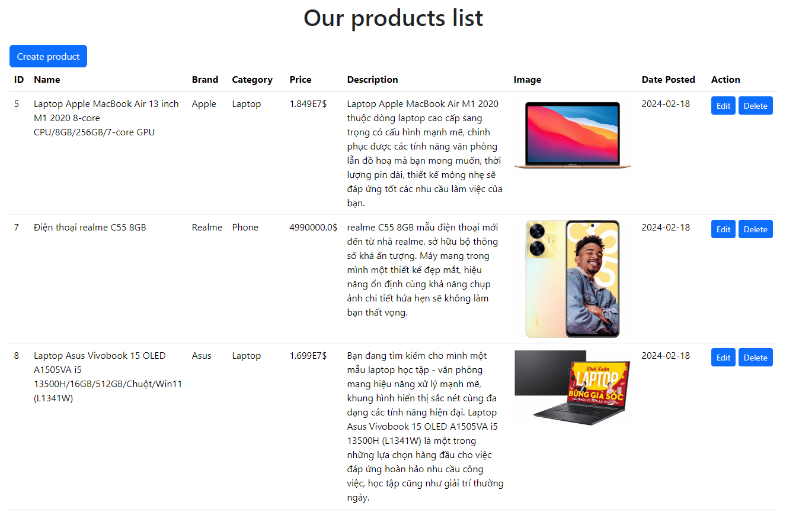
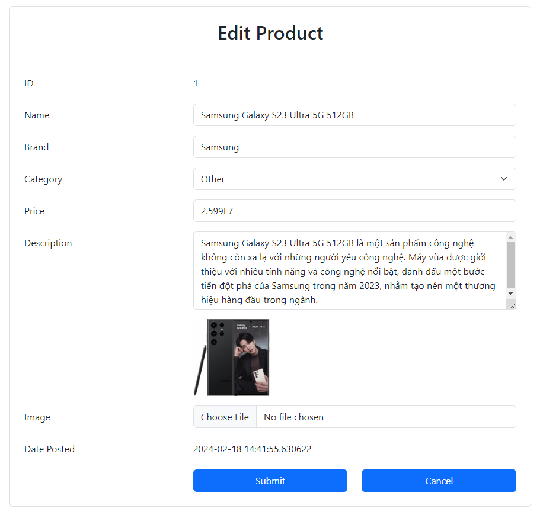

# E-Store Application

*\<Personal project\>*

Framework/Template Engine: Spring Boot, Thymeleaf, Bootstrap.

Database: PostgreSQL.

Container: Docker.

## Description

A server-side e-commerce store that returns the requested HTML. It follows CRUD which includes: listing all of the products or create, update, delete a single product.

